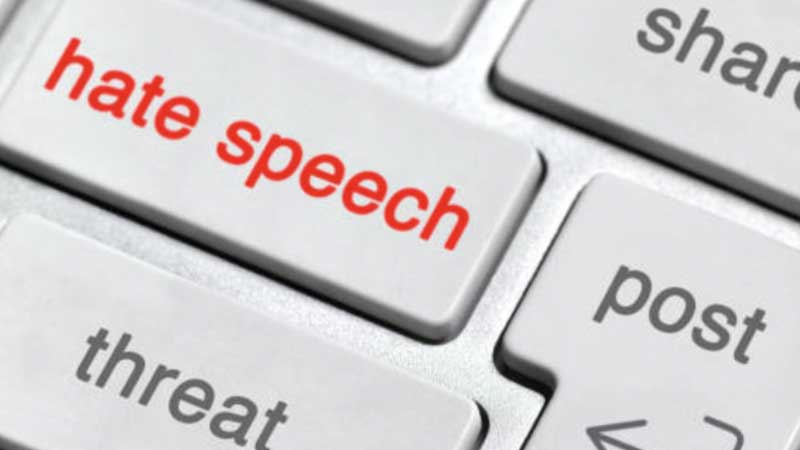
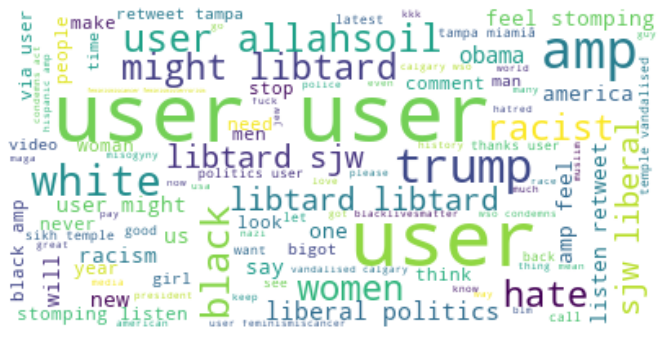

<h3> Use of Social media has been increasing day by day among people. Along with that, hate speech among users especially in a platform like Twitter is also increasing. So it is a tough challenge for companies to monitor each and every tweet of users.</h3>

  
* **In this project, I developed a machine learning model to identify the hate speech tweets automatically. **
* **The biggest problem which I faced was that the Twitter data set had only 25% of hate tweets, so if I try to build the model using this data,the model will perform better on the normal tweets as well,which won't solve our objective. So I had to oversample the hate tweets so that the two classes will have equal number of count and the model will work better.**

* **After preprocessing the data using *RegEx*, I used *WordCloud* to display all the common hate words in the tweets qs shown below**

* For model building, I created a Pipeline Model to trein all the classification algorithms.The ML Algorithms that were used were *Logistic Regression*, *Support Vector Classifier*,*Random Forest*, and *MultiNomial Naive Bayes*.
